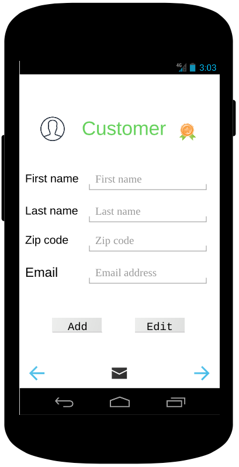

# Vision Document

**Author**: \<Team69\>

## 1 Introduction

Payment and Rewards Management System (PReMS) is an application running on the Android OS that will let user manage payment and reward information for mobile stalls. It is intended to be used by stall manager who need to know whether a stall customer get discount from a purchase, how many discount a customer has, etc. 

## 2 Business Needs/Requirements

Brad and Janet, farmers who sell their produce regularly at local farmers markets, have no better way to manage the condition of their customer's discount. They want to (1) allow their customers to pay using a credit card and (2) reward their most loyal customers. 

To reach the goals, they want to develop a management system. After they saw our team design, they need help to develop an Android app that implements the payment and rewards management system for mobile stalls. 

Since they were fascinated by unified modeling language (UML), they want our team to follow a UML-based process during the development of this system. 

## 3 Product / Solution Overview

PReMS will be an Android application that provides a user interface for management of customer, purchase and related discount information. By using this system, stall manager can save user information, display user's purchase record, and user's discount condition. The system will automatically determine user's discount according to purchase history and sent email to reminder customer about their discount. User can display summary of user's payment and rewards. 

In the future version we may 
- allow customer to decide when and how much they would like to use their discount
- allow user to add and edit more different discount level

## 4 Major Features (Optional)

*Here you outline the features at a high level (a detailed feature outline belongs in the requirements document.) Some people prefer to outline features in the above Product/Solution Overview section, which is also a fine approach. Whatever you do, keep it to bullet points, not paragraphs. If you can use pictures, such as mockups, even better.*

## 5 Scope and Limitations

*The Scope and Limitations section is where you talk about what is, and in particular, what is not included. This is where you tactfully tell your boss that his pet feature is not going to be included.*
The initial version of PReMS will focus on management of customer's transaction and related discount
. The software will not have features to 
- set account and password for user/stall manager. 
- save customer's security information of credit card, such as: security code. 

